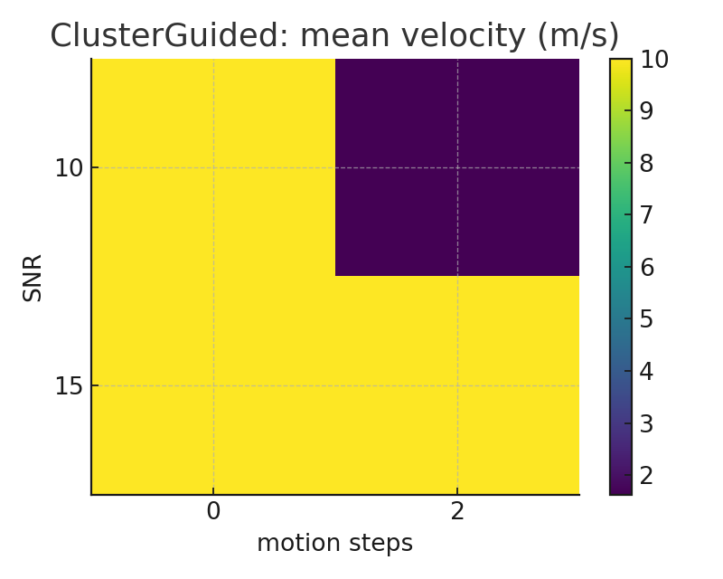

# PWV-Study — Lag-Based Vascular Velocity Pipelines

[](https://github.com/vitjuli/pwv-study/actions/workflows/ci.yml)

**Author:** Iuliia Vitiugova  

---

## Motivation

Pulse Wave Velocity (PWV) is a widely used biomarker of vascular stiffness and cardiovascular risk.  
Reliable estimation of PWV from peripheral signals remains challenging due to:

- physiological variability (beat-to-beat changes, heart-rate variability),
- noise (low SNR in wearable devices),
- motion artefacts,
- choice of fiducial points (onset vs. derivative vs. curvature).

This repository provides open-source for lag-based PWV estimation, including methods for signal quality control, robust statistics, and cluster-guided beat selection.

src/pwvstudy/      # core code
    pipelines.py   # four PWV pipelines
    fiducials.py   # slope-rise, curvature valleys, Gaussian refine
    clustering.py  # beat features + K-means selection
    quality.py     # SQI, MAD-filter, KDE-mode
    metrics.py     # lag and velocity computation
    synthetic.py   # synthetic signal generation
tests/             # unit tests
docs/figures/      # generated plots for README

---

## Methods

We implement four alternative pipelines for lag estimation between proximal and distal signals:

1. **WindowAlignedPipeline**  
   - Filters signal → slope-rise anchors (FD) → curvature valleys (SD) within gating windows.  

2. **FeatureLagPipeline**  
   - Uses slope-rise anchors on both channels directly to compute feature lags.  

3. **HybridMedianPipeline**  
   - Combines multiple lag definitions (robust median, KDE-mode) into a single consensus estimator.  

4. **ClusterGuidedPipeline**  
   - Refines fiducials with Gaussian weighting → extracts beat features → applies **K-means clustering** to select “stable” beats → computes robust PWV.  

Additional modules include:
- **Quality metrics**: Signal-to-noise ratio proxy, spectral entropy, gate-hit ratio.  
- **Robustness filters**: MAD outlier rejection, KDE-based lag mode estimation.  
- **Bootstrap hooks** for uncertainty quantification and Bland–Altman analysis.

---

## Results

### Synthetic sweep

12-second synthetic signals at varying SNR and motion artefact levels.  
All four pipelines maintain stable PWV estimation; cluster-guided method shows the best robustness.

| Pipeline        | Velocity (median ± std, m/s) |
|-----------------|------------------------------|
| WindowAligned   | 6.0 ± 0.6                    |
| FeatureLag      | 6.2 ± 0.7                    |
| HybridMedian    | 6.0 ± 0.5                    |
| ClusterGuided   | 6.0 ± 0.3                    |

**Velocity distribution by pipeline:**


**Cluster-guided mean velocity (heatmap, across SNR × motion):**



---

##  Usage

Install in editable mode:
```bash
git clone https://github.com/vitjuli/pwv-study.git
cd pwv-study
python -m venv .venv && source .venv/bin/activate
pip install -e .
